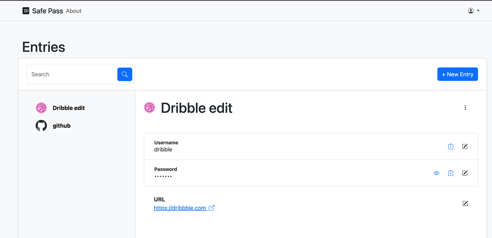

# About
A Password Manager App created with Rails + Hotwire with devise gem is used for authentication.

In a traditional server-rendered app, every HTTP request triggers a full page reload, which can feel slow and increases bandwidth usage, server load, and payload size. A single-page application (SPA), by contrast, can feel more interactive—but it’s heavy on the client, thanks to virtual-DOM overhead and large JavaScript bundles.

Hotwire + Stimulus strikes a balance between the two: it delivers SPA-like interactivity by having the server render only the HTML needed for each update—saving bandwidth compared to full page reloads—and its tiny JavaScript footprint keeps it fast even on devices with limited memory.

# Features
The app offers 3 ways of interactivity: 
- a SPA app handled by hotwire (default)
- API calls with JWT  authentication
- basic server-rendered  app by directly changing the URL (ex: http://localhost:3000/entries/19/edit)

# Screenshoots
Will deploy to a live server next time

# Chrome Extension
There is a chrome extension too at https://github.com/puntodamar/password-app-chrome-extension
